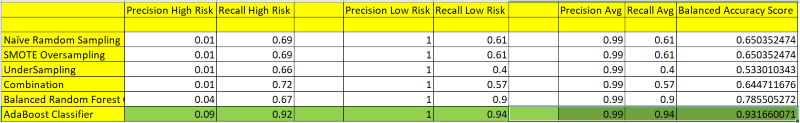

# SupervisedLearningCreditRisk Analysis
This project is to recomend a model for the credit risk using supervised machine learning.
Files included in this are: credit_risk_ensemble.ipynb & credit_risk_resampling.ipynb

## Analysis
Describes the precision and recall scores. 
Precision,  out of a group how many members that are out of total positives are true positives. The higher this score is better the model. Scores in the chart below Formula for Precision = TP/(TP + FP)

Recall, out of a group of positives, how many members are true positive. It is obtained by this formula. The higher this score is better the model. Scores in the chart below. Formula for Recall = TP/(TP + FN)

Balanced accuracy score is when the precision and recall are not trade of for each other. If both the number improve together its balanced accuracy.

 
### Final recommendation on the model to use,
From the above models if we go with resampling models, I think the results are close by. None of these models are giving good recall rate and balanced accuracy. So I will not recommend any of those.
But if we look at overall all the models analyzed, looking at the number for AdaBoost classifier, where the precision is 99% and recall is 94% with balanced accuracy of 93% I would highly recommend AdaBoost Classifier. This shows that it is highly likely that this model will give the best results.
